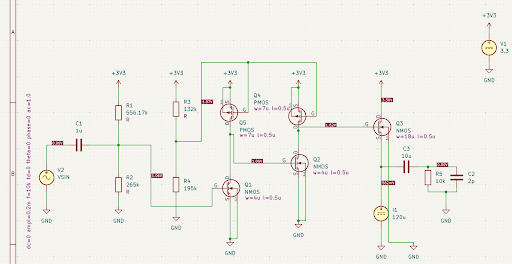
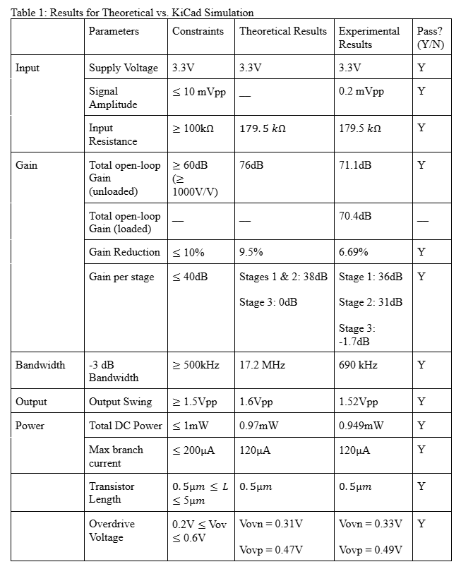

# telescopic-cascode-amplifier
This repository contains the design, simulation, and theoretical analysis of a three-stage MOSFET amplifier optimized for high gain and minimal power consumption. The architecture utilizes a Telescopic Cascode gain stage followed by a Source Follower buffer to balance significant voltage amplification with efficient load driving.  

****Design Overview****

The primary objective of this project was to achieve a voltage gain exceeding 60 dB while maintaining a total DC power consumption of less than 1 mW and a bandwidth of at least 500 kHz.  

****Architecture****

**Stage 1 & 2 (Gain):** A Telescopic Cascode topology was selected to achieve the 60 dB goal in a single high-impedance stage. By stacking gain transistors (Q1, Q2) above active PMOS loads (Q4, Q5), the design achieves significantly increased output resistance without the power penalty of multiple high-current stages.  

**Stage 3 (Buffer):** A Common-Drain (Q3) source follower is employed to isolate the high-impedance gain node from the 10k ohms load. This ensures the load does not significantly attenuate the voltage gain and provides the current necessary to drive the 12pF capacitive load.  

**Biasing:** Gate biases are provided by high-impedance voltage divider networks ($M\Omega$ range) to minimize current draw, leaving the majority of the 1mW power budget for the active signal path.  

## **Simulation Results**

